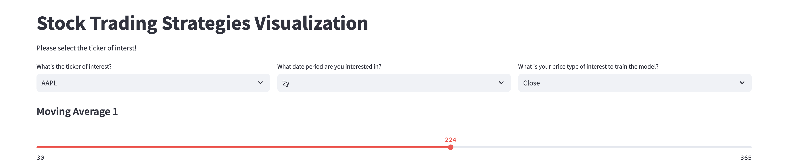
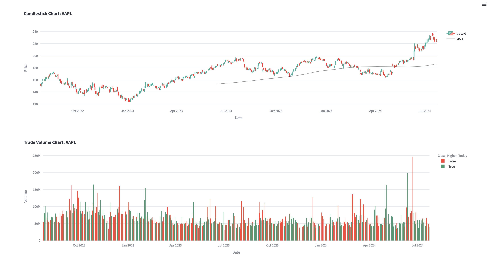
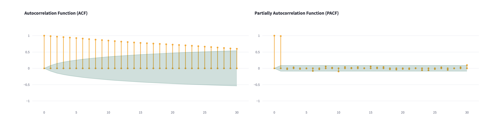
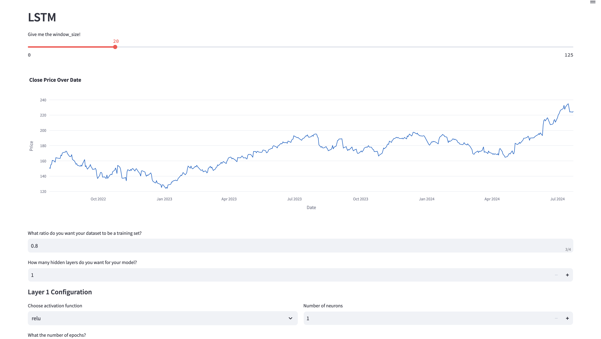
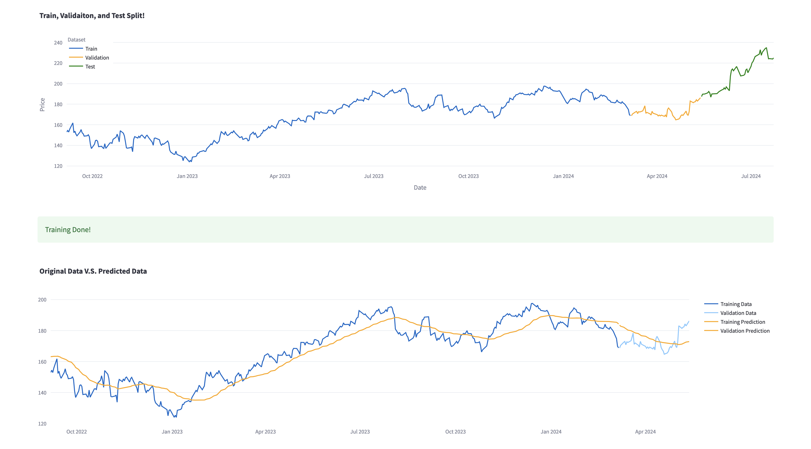
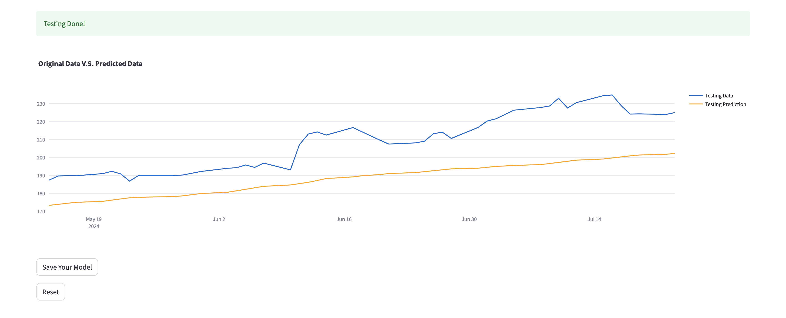

# Stock Trading Strategies Visualization 📈

This Streamlit application 🌟 enables users to visualize stock trading strategies and train Long Short-Term Memory (LSTM) models on selected stock tickers.

It offers interactive visualizations, including candlestick charts 📊, moving averages, trade volumes, autocorrelation functions (ACF), and partial autocorrelation functions (PACF).

Users can customize the LSTM model's parameters and train it on historical stock data for selected tickers.

## Features 🚀

- Selection of stock tickers from NYSE and NASDAQ.
- Visualization of historical stock data using candlestick charts.
- Interactive configuration of LSTM model parameters, including the number of hidden layers and learning rate.
- Training of LSTM models on historical data with customizable training-validation split.
- Visualization of training, validation, and testing results.
- ARIMA strategy placeholder for future implementations.

## Screenshots of the App 📸

First, This is the top of the webpage.

Here, we select the tick of interest, date period that we are interested, and the type of price that we are interested to predict in the below section of the webpage.

You can also select the number of days for the moving average. 



<br>

You can see the candle chart with the specified moving average line and trade volume chart of the chosen stock for the overall view of the stock itself.



After getting the sense of the overall trend of the stock, now it's time to see what lag has statistically significant correlation to the current (lag-0) by using ACF and PACF plot!



Now, it's time for us to build a model that you want! by tweaking hyperparamter, and seeing the plot result, you can build your own LSTM model!




Once you like the performance of your model, you can download the model and save it!




## Installation 🛠

Ensure you have Python 3.8+ and pip installed. Then, follow these steps to set up the project environment:

1. Clone the repository:

```
git clone https://github.com/SongofG/Trading_Strategy_Visualizaiton.git
```

2. Navigate to the project directory:
```
cd <project-directory>
```

3. Install the required dependencies:

```
pip install -r requirements.txt
```


## Usage 💡

To run the Streamlit application, execute the following command in the project directory:

```
streamlit run app.py
```

Upon running, the application will guide you through the following steps:

1. Select a stock ticker of interest.
2. Choose the period and price type for model training.
3. Configure the LSTM model parameters and initiate training.
4. Visualize the training, validation, and testing results.

## Acknowledgments 👏

- The utilization of Streamlit for interactive web applications.
- TensorFlow and Keras for LSTM model creation and training.
- Plotly for generating dynamic, interactive visualizations.
- yfinance for fetching historical stock data.
